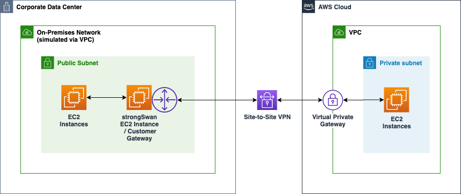
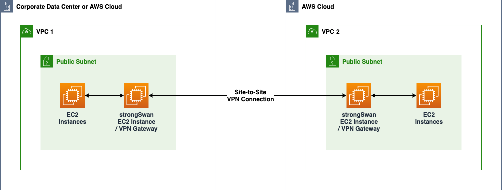

# VPN Gateway Stack Using strongSwan

An [AWS CloudFormation](https://aws.amazon.com/cloudformation/) template that can be used to automate deployment of the open source [strongSwan VPN solution](https://www.strongswan.org/) as a VPN gateway in support of several different [site-to-site VPN](https://docs.aws.amazon.com/vpn/latest/s2svpn/VPC_VPN.html) topologies.  The open source [Quagga](https://en.wikipedia.org/wiki/Quagga_(software) ) software suite complements the role of strongSwan by providing [Border Gateway Protocol (BGP)](https://searchnetworking.techtarget.com/definition/BGP-Border-Gateway-Protocol) support to automatically propagate routing information across site-to-site VPN connections.

Even if you don’t have a need to demonstrate integration with AWS site-to-site VPN capabilities, you might find value in reviewing the Infrastructure as Code (IaC) techniques demonstrated by the example AWS CloudFormation template including its built-in integrations with other AWS services to support logging, resource monitoring, and secure remote terminal access.

* [Use Cases and Topologies](#use-cases-and-topologies)
* [Integration with AWS Services](#cloudformation-features-demonstrated)
* [Usage](#usage)
* [CloudFormation Template Parameters](#cloudformation-template-parameters)
* [Troubleshooting](#troubleshooting)
* [Inspecting the strongSwan VPN Gateway EC2 Instance](#inspecting-the-strongswan-vpn-gateway-ec2-instance)
* [Advanced Usage](#advanced-usage)
* [Contributing](#contributing)
* [License](#license)

## Use Cases and Topologies

The example template can be useful for experimenting, testing, and demonstrating integration scenarios with the AWS Site-to-Site VPN feature and more formally implementing site-to-site VPN connections where use of managed AWS VPN services might not apply.

### Demonstration and Lab Environments

When you don’t have ready access to either real on-premises VPN hardware or software appliances, this example can be useful in demonstrating how to integrate an on-premises network with AWS networks via AWS site-to-site VPN connections and either AWS Virtual Private Gateways (VGWs) or AWS Transit Gateways (TGWs).

**Site-to-Site VPN with AWS Transit Gateway**

See [Transit Gateway Example: Centralized Router](https://docs.aws.amazon.com/vpc/latest/tgw/transit-gateway-centralized-router.html) for an overview of this topology.

In the following diagram, an EC2 instance deployed to a VPC that is emulating a customer’s on-premises network is running the strongSwan VPN stack and is acting as a VPN Customer Gateway in a site-to-site VPN configuration with an AWS Transit Gateway on the other end of the connection.


**Site-to-Site VPN with AWS Virtual Private Gateway**

See [AWS Site-to-Site VPN](https://docs.aws.amazon.com/vpn/latest/s2svpn/SetUpVPNConnections.html) for details on this configuration.

In the following diagram, an EC2 instance deployed to a VPC that is emulating a customer’s on-premises network is running the strongSwan VPN stack and is acting as a VPN Customer Gateway in a site-to-site VPN configuration with an AWS Virtual Private Gateway (VGW) on the other end of the connection.



### Both Ends of a DIY Site-to-Site VPN Connection

The example template can also be used to establish a VPN Gateway on both ends of a site-to-site VPN connection in scenarios where VGWs and TGWs are not applicable. Normally, you would use either VPC Peering or AWS Transit Gateway when you control the environments on both ends of a site-to-site VPN connection, but there may be circumstances in which you want to manage the VPN gateway on both ends.



## Integration with AWS Services

The example AWS CloudFormation template automatically builds a stack that demonstrates use of the following AWS services, features, and best practices:

* AWS CloudFormation features including the [`AWS::CloudFormation::Init`](https://docs.aws.amazon.com/en_pv/AWSCloudFormation/latest/UserGuide/aws-resource-init.html) feature to completely automate the build out of the VPN gateway stack and BGP support upon first boot and the [`AWS::CloudFormation::WaitCondition`](https://docs.aws.amazon.com/en_pv/AWSCloudFormation/latest/UserGuide/aws-properties-waitcondition.html) feature to force the stack creation process to wait until the first boot build out is complete.

*	[Amazon EC2](https://aws.amazon.com/ec2/) provides the compute platform in which to deploy the strongSwan VPN gateway.

*	[Amazon CloudWatch Logs](https://docs.aws.amazon.com/AmazonCloudWatch/latest/logs/WhatIsCloudWatchLogs.html) integration via the [CloudWatch Logs Agent](https://docs.aws.amazon.com/en_pv/AmazonCloudWatch/latest/logs/CWL_GettingStarted.html) in which OS, VPN gateway, and BGP log files are written to a series of log streams in a CloudWatch Logs log group.

* [Amazon CloudWatch](https://aws.amazon.com/cloudwatch/) integration for [monitoring EC2 memory and disk metrics](https://docs.aws.amazon.com/en_pv/AWSEC2/latest/UserGuide/mon-scripts.html).

* [AWS Systems Manager Session Manager](https://docs.aws.amazon.com/en_pv/systems-manager/latest/userguide/session-manager.html) to enable secure terminal access to the OS instance without the need to establish Internet accessible bastion hosts and port 22 access to the VPN gateway.

* [AWS Secrets Manager](https://aws.amazon.com/secrets-manager/) to support secure storage and retrieval of the private key passphrase when certificate-based authentication is used for your site-to-site VPN connection.

* [Systems Manager Parameter Store](https://aws.amazon.com/blogs/compute/query-for-the-latest-amazon-linux-ami-ids-using-aws-systems-manager-parameter-store/) to query for latest Amazon Linux 2 Amazon Machine Image (AMI) images.

* Standardized naming of cloud resources to help distinguish from other resources, identify ownership, and potentially aid in access control.

## Usage

The following instructions are primarily oriented toward the first use case and two deployment topologies described above: Site-to-Site VPN with AWS Transit Gateway and Site-to-Site VPN with Virtual Private Gateway.  If you're interested in demonstrating a DIY solution for both ends of a site-to-site VPN connection, you should be able to easily extend these instructions.

### 1. Determine authentication approach

This template supports pre-shared key- and certificate-based authentication.  

#### Pre-Shared Key-Based Authentication

You'll obtain the the pre-shared keys for the two tunnels after you've configured the site-to-site VPN connection.

#### Certificate-Based Authentication

In support of certificate based authentication, you will need to supply the following certificates:

* Client certificate .pem file
* Client private key .pem file
* Root CA certificate .pem file
* Subordinate CA certificate .pem file

The certificates need to be present in an S3 bucket that is accessible from the AWS account in which you're deploying the VPN gateway stack.

You'll also need to supply:

* Name of a secret in AWS Secrets Manager that contains the passphrase for the client private key file. The secret must have a `key:value` pair with a `key` set to "passphrase" and a value that matches the passphrase used to protect the client private key file.
* Common name (CN) from the certificate for each of the two VPN tunnels associated with the remote virtual gateway.

See [How do I create a certificate-based VPN using AWS Site-to-Site VPN?](https://aws.amazon.com/premiumsupport/knowledge-center/vpn-certificate-based-site-to-site/) for more details.

### 2. Determine Deployment Location: Public or Private Subnet

Since VPN connections typically occur over the public Internet, you'll need to have at least one public IP address to represent the local side of the VPN tunnels.  You have several options to associate a public IP address. In either case, decoupling the creation and management of the public IP address from the creation and management of the VPN gateway enables you to replace the VPN gateway stack including the associated strongSwan EC2 instance without needing to reconfigure the remote end of the site-to-site VPN connection.

#### Option 1: Deploy VPN Gateway in Public Subnet and Use Elastic IP Address

Before deploying this stack, create an Elastic IP (EIP) address and obtain its allocation ID so that you can pass it as a parameter to the CloudFormation stack through which the VPN gateway will be created.  When deploying this stack, you set the parameter `pUseElasticIp` to `true` and supply a value for the `pEipAllocationId` parameter.

#### Option 2: Deploy VPN gateway in Private Subnet and Use a NAT Gateway

In this case, you discover the public IP address of the NAT Gateway and use it when configuring the remote side of the VPN connection.  When deploying this stack, you accept the default `false` setting for the `pUseElasticIp` parameter. Since the local side of the site-to-site VPN initiates the connection, the local strongSwan VPN gateway will initiate the connection through the NAT Gateways public IP address.

### 3. Determine VPN Tunnel Configuration Settings

When using either AWS VGWs or TGWs for the remote end of the site-to-site VPN connection, a site-to-site VPN connection resource will be established in AWS on the remote site. Within the site-to-site VPN connection resource on the remote site, you can download a VPN configuration file that will provide you with much of the data required to deploy the local VPN gateway. In the AWS management console, see `VPC -> Site-to-Site VPN Connections`, select the connection of interest, click `Download` and select the `Generic` option for `Vendor` and download the configuration file.

Review the data in this file in preparation for passing it as parameters to the CloudFormation stack in the next step.

### 4. Deploy VPN Gateway Stack

In this step you'll create a CloudFormation stack using the [`vpn-gateway-strongswan.yml`](https://raw.githubusercontent.com/aws-samples/vpn-gateway-strongwswan/master/vpn-gateway-strongswan.yml) template and configuration data obtained from the remote site's Site-to-Site VPN Connection resource.

You can either use the AWS management console or an included helper script and the AWS CLI to create the stack.  Given the number of parameters, you might find it easier to use the CLI so that you can specify the parameter values once in a JSON file as opposed to entering them via the AWS management console.

#### Use AWS Management Console

Use the CloudFormation template to deploy a VPN gateway stack in an appropriate subnet based on the [CloudFormation Template Parameters](#cloudformation-template-parameters) described below.

1. Use the [AWS Management Console](https://console.aws.amazon.com/cloudformation/home) to access the CloudFormation service.
1. Ensure that the desired AWS region is selected.
1. Select "Create Stack" and select "With new resources".
1. Select "Upload a template file"

1. Use your browser to download the [`vpn-gateway-strongswan.yml`](https://raw.githubusercontent.com/aws-samples/vpn-gateway-strongwswan/master/vpn-gateway-strongswan.yml) CloudFormation template file to your local computer.
1. Select "Choose file" to select the CloudFormation template file that you downloaded.
1. Select "Next" to "Specify stack details".
1. Enter a name for your new CloudFormation stack. For example, "vpn-gateway".
1. Override and/or fill in the required parameters.  See [CloudFormation Template Parameters](#cloudformation-template-parameters) for details.
1. Select "Next" to "Configure stack options".
1. Select "Next" to review your stack settings.
1. Select "Create stack".

#### Use AWS CLI

If you have the AWS CLI installed, you might find it easier to use the included shell script `manage-stack` to create the stack.

1. Clone this repository to your local system on which you have the AWS CLI installed.
2. Customize one of the `template-parameters-*.json` files containing example sets of parameters for your stack.
3. Execute the `manage-stack` wrapper script to create the stack. Here are the option arguments that are commonly used with this script:

|Option Argument|Required?|Description|Default|
|---------|--------|-----------|-------|
|`-e` or `--env-purpose`|Conditional. Required when `-stack-name` is not specified.|Use to qualify the stack name of the form `vpn-gateway-<env-purpose>`. For example, `-e mytest` results in a stack name of `vpn-gateway-mytest`.|None|
|`-s` or `--stack-name`|Conditional. Required when `--env-purpose` is not specified.|Specifies the name to assign to the newly created stack.|None|
|`-r` or `--region`|Optional|AWS region. Since the `aws` CLI is used, the standard environment variables are honored.|The `aws` CLI will use the standard `AWS_DEFAULT_REGION` environment variable if set.|
|`-p` or `--profile`|Optional|AWS profile. Since the `aws` CLI is used, the standard environment variables are honored.|The `aws` CLI will use the standard `AWS_PROFILE` environment variable if set.|

An example execution:

```
$ ./manage-stack -e mystack1 --region us-east-1 template-parameters-certificate-auth.json
```
Execution of this command would result in an attempt to create a new stack of the name `vpn-gateway-mystack1`.

Monitor the progress of stack creation via the AWS management console.

#### After Starting the Create Stack Process

* Wait for creation of the stack to complete. Since the template uses a wait condition, the stack won't complete until strongSwan and other components have been configured and started.
* Wait for several minutes after stack creation completes. Then monitor the Site-to-Site VPN Connection on the remote site to confirm that the two VPN tunnels have progressed from the `DOWN` state to the `UP` state.  If the VPN gateway configuration is correct, Tunnel 1 will come up first followed several minutes later by Tunnel 2.

If the tunnels have not come up 3-5 minutes after creation of the VPN gateway stack completed, then see the [Troubleshooting](#troubleshooting) section below.

### 4. Ensure Routing Tables and EC2 Security Groups Are in Place

On both sides of the site-to-site VPN connection, ensure that the appropriate routing and security group configurations are in place to enable proper routing of traffic. For example:

* In support of testing, ensure that testing EC2 instances can receive ICMP or ping traffic.
* Ensure VPC route tables associated with subnets route traffic destined for the other site to the local VPN gateway instance.
* If using Transit Gateway on the remote site, ensure that VPC route tables are configured to route traffic destined for the other site to the Transit Gateway. (Although the built-in BGP support in this stack will ensure that both the local VPN gateway's route information and the remote Transit Gateway's route table will be automatically configuired, you still need to ensure that the VPC route tables in both sites are properly configured).

### 5. Test

* Deploy an Amazon Linux EC2 instance to one of the local subnets.  
    * Ensure ICMP is allowed as inbound traffic.
    * Set it up for SSH access in one of two ways:
      * Systems Manager Session Manager: No SSH and publicly accesible IP address required. Instead, create an IAM role for EC2 that includes the `AmazonSSMManagedInstanceCore` policy and attach it to the EC2 instance via the `Actions -> Instance Settings -> Attach/Replace IAM Role`.
      * SSH: Ensure that the security group allows for SSH inbound access and that the instance has a publicly accessible IP address.
* Deploy another EC2 instance in the remote site with the same configuration as above.
* Validate that route tables and security groups are properly configured.
* Use `ping` on one of the two ends to validate routing and connectivity between the instances.
* Use `# tcpdump -eni any icmp` to on the target instance to monitor traffic.

## CloudFormation Template Parameters

|Parameter|Required|Description|Default|
|---------|--------|-----------|-------|
|**System Classification and Environment**| | | |
|`pOrg`|Optional|As an example of using resurce naming standards, include the business organization in the names of resources including, for example, IAM roles.|`example`|
|`pSystem`|Optional|As an example of using resurce naming standards, include a system identifier in the names of resources including, for example, IAM roles..|`infra`|
|`pApp`|Optional|As an example of using resurce naming standards, include an application identifier in the names of resources including, for example, IAM roles.|`vpngw`|
|`pEnvPurpose`|Required|As an example of using resurce naming standards, include a purpose for this particulart instance of the stack in the names of resources including, for example, IAM roles.. For example, "dev1", "test", "1", etc.|None|
|**Authentication**| | | |
|`pAuthType`|Optional|The type of authentication. Either `psk` or `pubkey`. Use `pubkey` for certificate-based authentication.|`psk`|
|`pCertBucket`|Optional|Name of S3 bucket containing the following certificate files in `.pem` format. Required when using certificate-based authentication.|None|
|`pClientPublicCert`|Optional|Name of client public certificate file residing in S3. Required when using certificate-based authentication.|None|
|`pClientPrivateCert`|Optional|Name of client private certificate file residing in S3. Required when using certificate-based authentication.|None|
|`pClientPrivateCertPassphraseSecretName`|Optional|Name of secret in AWS Secrets Manager containing the passphrase for the client private certificate file residing in S3. Required when using certificate-based authentication.<br><br>AWS Secrets Manager secret must be in the form of `passphrase:<value>` where `passphrase` is the key and `<value>` is the passphrase value.|None|
|`pRootCaPublicCert`|Optional|Name of root CA certificate file residing in S3. Required when using certificate-based authentication.|None|
|`pSubordinateCaPublicCert`|Optional|Name of subordinate CA certificate file residing in S3. Required when using certificate-based authentication.|None|
|**VPN Tunnel 1**| | | |
|`pTunnel1Psk`|Optional|See the remote site's configuration for the "IPSec Tunnel #1" section and "Pre-Shared Key" value. Required when using PSK-based authentication.|None|
|`pTunnel1VgwCertCommonName`|Optional|Common name (CN) of certificate associated with tunenl 1. Required when using certificate-based authentication.|None|
|`pTunnel1VgwOutsideIpAddress`|Required|See the remote site's configuration for the "IPSec Tunnel #1" secton, "Outside IP Addresses" section and "Virtual Private Gateway" value.|None|
|`pTunnel1CgwInsideCidr`|Required|See the remote site's configuration for the "IPSec Tunnel #1" secton, "Inside IP Addresses" section and "Customer Gateway" value.|None|
|`pTunnel1VgwInsideCidr`|Required|See the remote site's configuration for the "IPSec Tunnel #1" secton, "Inside IP Addresses" section and "Virtual Private Gateway" value.|None|
|`pTunnel1VgwBgpAsn`|Optional|See the remote site's configuration for the "BGP Configuration Options" and the "Virtual Private  Gateway ASN" value.|`64512`|
|`pTunnel1BgpNeighborIpAddress`|Required|See the remote site's configuration for the "BGP Configuration Options" and the "Neighbor IP Address" value.|None|
|**VPN Tunnel 2**| | | |
|`pTunnel2Psk`|Optional|See the remote site's configuration for the "IPSec Tunnel #2" section and "Pre-Shared Key" value. Required when using PSK-based authentication.|None|
|`pTunnel2VgwCertCommonName`|Optional|Common name (CN) of certificate associated with tunenl 2. Required when using certificate-based authentication.|None|
|`pTunnel2VgwOutsideIpAddress`|Required|See Tunnel 1.|None|
|`pTunnel2CgwInsideCidr`|Required|See Tunnel 1.|None|
|`pTunnel2VgwInsideCidr`|Required|See Tunnel 1.|None|
|`pTunnel2VgwBgpAsn`|Optional|See Tunnel 1.|`64512`|
|`pTunnel2BgpNeighborIpAddress`|Required|See Tunnel 1.|None|
|**Local Network Configuration**| | | |
|`pVpcId`|Required|The VPC in which the VPN gateway is to be deployed.|None|
|`pVpcCidr`|Required|The CIDR block of the local VPC. Used to advertise via BGP routing information to the remote site.|None|
|`pSubnetId`|Required|The subnet in which the VPN gateway is to be deployed.|None|
|`pUseElasticIp`|Optional|Use elastic IP address?|`true`|
|`pEipAllocationId`|Conditional|The allocation ID of the Elastic IP address that is to be associated with the VPN gateway. Required when `pUseElasticIP` = `true`|None|
|`pLocalBgpAsn`|Optional|The BGP Autonomous System Number (ASN) used to represent the local end of the site-to-site VPN connection.|`65000`|
|**EC2 Instance**| | | |
|`pAmiId`|Optional|The ID of the AMI to use for the VPN gateway. By default this Systems Manager Parameter Store key is used to lookup the latest version of the referenced AMI for use in the current region.|`/aws/service/ami-amazon-linux-latest/amzn2-ami-hvm-x86_64-ebs`|
|`pInstanceType`|Optional|The EC2 instance type to use for the VPN gateway.|`t3a.micro`|

## Troubleshooting

### Stack creation fails quickly

Verify your parameter settings against both your local network configuration and the configuration of the site-to-site tunnels.  If you're using an Elastic IP address, ensure that the allocation ID is correct.

### Stack creation fails afer a long period of time

You may find that the stack creation fails after multiple minutes and resources are rolled back.  In this case, it's best to delete the stack and use the CLI approach described above in an attempt to create the stack again.  However, this time, you'll use CloudWatch logs to inspect the progress of the first boot configuration steps during stack creation.

Similar to the previous circumstance, verify your parameter settings against both your local network configuration and the configuration of the site-to-site tunnels.  If you're using an Elastic IP address, ensure that the allocation ID is correct.

If no obvious issues are identified based on a review of the template parameters, delete the failed stack and use the CLI approach in an attempt to create the stack again.  This time, during stack creation, inspect the CloudWatch logs group to gain insight into failures that might be occuring during the first boot configuration process. For example, if the S3 bucket name for certificate key files is incorrect, the first boot configuration process may fail.

Specifically, access the `cfn-init.log` log stream to review the first boot configuration for any errors. By default, the log group for you EC2 instance will be named `/infra/vpngw/ec2/<environment purpose>`.

If the `cfn-init.log` log stream looks clean, then review the `charon.log` log stream for errors. If you're using certificate-based authentication and your certificates and key files are incorrect, then you'll typically see errors in this log stream.

### Tunnels Don't Come Up

Ensure that you've waited 5 minutes or so to give the tunnels time to establish.

It's likely that one or more of the tunnel related stack parameters is incorrect. Double check the settings.  You can delete and recreate the VPN gateway stack without needing to delete and recreate the remote site's VPN resources.

You can also inspect the VPN gateway's logs via CloudWatch Logs.  In CloudWatch Logs, look for a log group that is named based on the system classification parameters described above. For example: `/infra/vpngw/ec2/...`. 

If any of the following log files are not present: `charon.log`, `zebra.log`, `bgpd.log`, start a terminal session with the gateway instance and use the `systemctl status <service name>` command to understand why a service did not start.

Log files in order of importance are:

* `cf-init.log` - Look for successful execution of the configuration sets from the `AWS::CloudFormation::Init` section of the CloudFormation template.
* `charon.log` - If initialization looks ok, check the content of this log file to monitor the establishment of the VPN tunnels.

### Can't Ping Across the VPN Connection

Verify correctness of the following configurations on both sides of the site-to-site VPN connection:
* EC2 instance security groups.
* Route tables.

Consider using `tcpdump` on the VPN gateway EC2 instance to see if traffic is being routed through the gateway.

## Inspecting the strongSwan VPN Gateway EC2 Instance

If any of the following log files are not present in CloudWatch Logs: `charon.log`, `zebra.log`, `bgpd.log`, start a terminal session with the VPN gateway instance and execute a command to display error messages associated with services starting up on the strongSwan EC2 instance.

### Accessing a Terminal Session

Since the CloudFormation stack configures the VPN gateway EC2 instance to support terminal access through AWS Systems Manager Session Manager, you can easily connect to the strongSwan EC2 instance via the EC2 portion of the AWS management console.

1. Access the EC2 service of the AWS Management Console
1. Choose the strongSwan EC2 instance. For example, infra-vpngw-test
1. Choose "Connect" in the upper portion of the console
1. Choose the "Session Manager" option
1. Choose "Connect"

You should be presented with a terminal session of the EC2 instance.

### Inspecting strongSwan

Use the following commands to display errors associated with starting the following services:

```
$ systemctl status strongswan

$ systemctl status zebra

$ systemctl status bgpd
```

You can review the status of the strongSwan application via sudo strongswan status command. Execution of this command should show that both tunnels are connected:

```
$ sudo strongswan status

Security Associations (2 up, 0 connecting):
AWS-VPC-TUNNEL-1[135]: ESTABLISHED 2 hours ago, 10.0.0.221[10.0.0.221]...18.222.98.126[18.222.98.126]
AWS-VPC-TUNNEL-1{1358}:  REKEYED, TUNNEL, reqid 1, expires in 6 minutes
AWS-VPC-TUNNEL-1{1358}:   0.0.0.0/0 === 0.0.0.0/0
AWS-VPC-TUNNEL-1{1360}:  INSTALLED, TUNNEL, reqid 1, ESP in UDP SPIs: c2217636_i c2fc4ee3_o
AWS-VPC-TUNNEL-1{1360}:   0.0.0.0/0 === 0.0.0.0/0
AWS-VPC-TUNNEL-2[134]: ESTABLISHED 6 hours ago, 10.0.0.221[10.0.0.221]...52.15.138.189[52.15.138.189]
AWS-VPC-TUNNEL-2{1357}:  REKEYED, TUNNEL, reqid 8, expires in 4 minutes
AWS-VPC-TUNNEL-2{1357}:   0.0.0.0/0 === 0.0.0.0/0
AWS-VPC-TUNNEL-2{1359}:  INSTALLED, TUNNEL, reqid 8, ESP in UDP SPIs: cff85483_i 87052d38_o
AWS-VPC-TUNNEL-2{1359}:   0.0.0.0/0 === 0.0.0.0/0
```

If you're using certificated-based authentication, you can inspect the certificates loaded by strongSwan:

```
# strongswan listcerts  # list the public certificates

# strongswan listcacerts # list the CA certificates
```

You can inspect the BGP routes that Quagga knows about by executing the `sudo vtysh` command followed by the `show ip bgp summary` subcommand. In the following example, the BGP tunnel neighors are listed:

```
$ sudo vtysh

Hello, this is Quagga (version 0.99.22.4).
Copyright 1996-2005 Kunihiro Ishiguro, et al.

ip-10-0-0-221.corp.ckamps-acme.com#  show ip bgp summary

BGP router identifier 10.0.0.221, local AS number 65000
RIB entries 3, using 336 bytes of memory
Peers 2, using 9120 bytes of memory

Neighbor        V    AS MsgRcvd MsgSent   TblVer  InQ OutQ Up/Down  State/PfxRcd
169.254.54.17   4 64512  182713  182714        0    0    0 03w0d03h        1
169.254.227.237 4 64512  182593  182632        0    0    0 14:36:47        1

Total number of neighbors 2
```

Next, you can inspect the routes by executing the `show ip route` subcommand. In the following example, 10.4.0.0/19 represents the route advertised by the transit gateway via BGP.

```
# show ip route

Codes: K - kernel route, C - connected, S - static, R - RIP,
       O - OSPF, I - IS-IS, B - BGP, A - Babel,
       > - selected route, * - FIB route

K>* 0.0.0.0/0 via 10.0.0.1, eth0
C>* 10.0.0.0/24 is directly connected, eth0
B>* 10.4.0.0/19 [20/100] via 169.254.54.17, vti1, src 10.0.0.221, 03w0d03h
C>* 127.0.0.0/8 is directly connected, lo
C>* 169.254.54.16/30 is directly connected, vti1
K>* 169.254.169.254/32 is directly connected, eth0
C>* 169.254.227.236/30 is directly connected, vti2
```

## Advanced Usage

### Updating a VPN Gateway Stack

If you need to change resources that are configured outside of the `UserData` and `Metadata` sections of the `AWS::EC2::LaunchTemplate`, you should be able to update either the template or stack parameters and update the stack in place.

Until the `AWS::EC2::LaunchTemplate` is modified to support stack updates (see `TODO.md`), any changes in the `UserData` and `Metadata` sections of that resource require replacement of the stack.

### Replacing a VPN Gateway Stack

Since the Elastic IP Address resource is managed via a distinct CloudFormation stack, you can delete a VPN gateway stack without also deleting the associated EIP address. If you are using the VPN gateway stack to set up a site-to-site VPN with AWS VPG or TGW resources, you can simply delete the existing VPN gateway stack and create a new stack with the same parameters.  The remote side of the site-to-site VPN connection will automatically reconnect once the new VPN gateway has been established.

After deploying the new VPN gateway stack, you will need to ensure that any local routing table entries are updated to point to the new VPN gateway EC2 instance.

### Masking Source IP Addresses

If you'd like the VPC in which the strongSwan VPN gateway is running to forward traffic from the VPN connection to either other VPCs via VPC Peering or onward via gateways such an Internet Gateway to NAT Gateway, you'll need to configure the VPN gateway to mask the original source IP address by using the VPN gateway's IP address.

You can implement source network IP masking via an `iptables` command.  For example, the following command when run on the strongSwan VPN gateway will mask the source IP address only for traffic whose destination IP address does not match the specified network. e.g. It will mask traffic destined for the Internet, but not for the local network. Presence of the `!` argument prior to the `-d` argument ensures that the all destinations other than the stated network will be subject to the masking rule.

```
$ sudo /sbin/iptables -t nat -A POSTROUTING -o eth0 ! -d 10.0.0.0/16 -j MASQUERADE
```
Alternatively, you can choose to mask all traffic:

```
$ sudo /sbin/iptables -t nat -A POSTROUTING -o eth0 -j MASQUERADE
```

Other useful `iptables` commands include:

```
# List the current rules:

# With packet counts:

$ sudo iptables -t nat -L -v

Chain PREROUTING (policy ACCEPT 12 packets, 1001 bytes)
 pkts bytes target     prot opt in     out     source               destination

Chain INPUT (policy ACCEPT 1 packets, 93 bytes)
 pkts bytes target     prot opt in     out     source               destination

Chain OUTPUT (policy ACCEPT 234 packets, 16318 bytes)
 pkts bytes target     prot opt in     out     source               destination

Chain POSTROUTING (policy ACCEPT 152 packets, 11245 bytes)
 pkts bytes target     prot opt in     out     source               destination
   93  5981 MASQUERADE  all  --  any    eth0    anywhere            !10.0.0.0/16

# With line numbers:

$ sudo iptables -t nat -L --line-numbers

Chain PREROUTING (policy ACCEPT)
num  target     prot opt source               destination

Chain INPUT (policy ACCEPT)
num  target     prot opt source               destination

Chain OUTPUT (policy ACCEPT)
num  target     prot opt source               destination

Chain POSTROUTING (policy ACCEPT)
num  target     prot opt source               destination
1    MASQUERADE  all  --  anywhere            !10.0.0.0/16

# Delete a specific rule based on line number:

$ sudo iptables -t nat -D POSTROUTING 1
```
See [TODO.md](./TODO.md) for an entry calling for the optional automation of source IP masking.

## Contributing

See [CONTRIBUTING.md](./CONTRIBUTING.md) for the contribution process.

File an issue in GitHub, ensure your changes pass `cfn-lint` tests and functionally work, before submitting a Pull Request (PR) for consideration.

## License

This project is licensed under the [Apache-2.0 License](./LICENSE).
